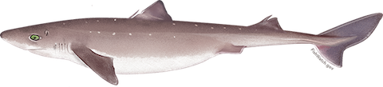
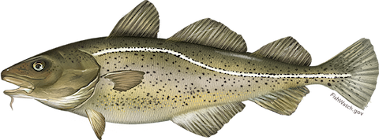
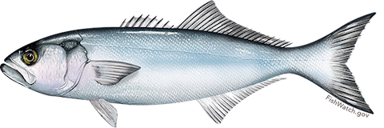
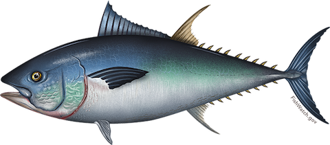

```{r setup, echo = FALSE, message = FALSE, warning = FALSE}
knitr::opts_chunk$set(
	echo = TRUE,
	message = FALSE,
	warning = FALSE
)
options(scipen = 1, digits = 4, width = 80)

plot.fitted_vs_residuals <- function(model){
  plot(fitted(model),
       resid(model),
       main="Fitted vs. Residuals",
       col = "darkorange",
       xlab = "Fitted",
       ylab = "Residuals")
  abline(h = 0,
         col = "navy",
         lty = 2)
}

residplot <- function(fit, nbreaks = 10) {
  z <- rstudent(fit)
  hist(z, breaks = nbreaks, freq = FALSE,
       xlab = "Studentized Residual",
       main = "Distribution of Errors")
  rug(jitter(z), col = "brown")
  curve(dnorm(x, mean = mean(z), sd = sd(z)),
        add = TRUE, col = "blue", lwd = 2)
  lines(density(z)$x, density(z)$y,
        col = "red", lwd = 2, lty = 2)
  legend("topright",
         legend = c("Normal Curve", "Kernel Density Curve"),
         lty = 1:2, col = c("blue","red"), cex = .7)
  }


plot.normal_QQ <- function(model){
  qqnorm(resid(model),
         main = "Normal Q-Q Plot",
         col = "darkorange")
  qqline(resid(model),
         col = "navy",
         lwd = 2)
}

rmse <- function(model) {
  sqrt((1/length(model$residuals))*sum(model$residuals^2))
}

loocv_rmse = function(model) {
  sqrt(mean((resid(model)/(1-hatvalues(model)))^2))
}
```

<br>
<center>
<font size=+1>
**Are Linear Models Effective Predictors of Predator-Prey Interactions in Marine Food Webs?**</font>
</center>
<br>

## Introduction

Marine fisheries are a healthy and abundant source of protein for human consumption[^1], as well as a rich source of fertilizer[^2] and fodder[^3] for terrestrial food production. As populations increase in the developing world[^4], it will become essential to maintain high quality fisheries to sustain the ever increasing caloric demands of the world's population[^5]. Therefore, it is important to understand as much as we can about how best to maintain and contribute to the health of populations of commercial fishery species.

[^1]: https://www.ncbi.nlm.nih.gov/pubmed/11790957

[^2]: http://www.ecori.org/green-economy/2015/1/15/reuse-of-fish-waste-yields-organic-liquid-fertilizer

[^3]: http://www.fao.org/docrep/003/w3647e/W3647E07.htm

[^4]: http://www.dw.com/en/population-growth-challenges-poor-nations/a-17010329

[^5]: http://www.who.int/nutrition/topics/3_foodconsumption/en/index4.html


Marine food webs are incredibly complex. Understanding how they work will improve our understanding of how best to maintain fish stocks. For example, in order to maintain stocks of large highly-prized species like Atlantic Cod and Bluefin Tuna, do we also need to worry about over-fishing their prey? We will ask if linear models are good predictors of the size of prey for a particular size of predator. If so, we can conclude not only how much, but of what sizes of prey species are needed to be maintained in order to keep stocks of larger predator species healthy.


Because marine species tend to have a wide array of novel morphological and behavioral differences, in comparing species, we should be careful to compare species with similar behaviors and ecological roles. In this study we will look at four species of predators with two distinct types of ecology.

First, we will look at two Benthopelagic species. Benthopelagic sharks, like squaloid sharks such as the Atlantic Spiny Dogfish, *Squalus acanthias*, achieve neutral buoyancy with the use of large oil-filled livers[^6]. This allows them to adapt well to fairly high pressures and they can often be found on slopes down to about 2000 meters, scavenging on food falls such as dead whales. However, the energy demands of sharks are high since they need to swim constantly and maintain a large amount of oil for buoyancy. These energy needs cannot be met in the extreme oligotrophic conditions that occur at great depths, therefore they tend to stay in shallower locations closer to shore[^6].

[^6]: Bone 2008, p. 42.

<center>
<table>
<tr>
<td>
<br><br>
**Atlantic Spiny Dogfish**, *Squalus acanthias*
</td>
</tr>
</table>
</center>
<br>

Likewise, demersal fish such as the Atlantic Cod, *Gadus morhua*, which live and feed on or near the bottom of seas occupy sea floors which usually consist of mud, sand, gravel or rocks are usually found between 150 and 200 meters. They are omnivorous and feed on invertebrates and fish, including young cod[^7]. (For this reason, we will only examine Adults in this study.)

[^7]: Steneck, R. S. (14 May 2012). "Apex predators and trophic cascades in large marine ecosystems: Learning from serendipity". Proceedings of the National Academy of Sciences. 109 (21): 7953–7954. doi:10.1073/pnas.1205591109


They are both opportunistic feeders that forage on the bottom as well as in mid-water and near the surface, either alone or in hunting shoals[^8].

[^8]: Pitcher, TJ, Parrish JK (1993). Functions of shoaling behaviour in teleosts. Chapman and Hall. pp. 363–427.


<center>
<table>
<tr>
<td>
<br><br>
**Atlantic Cod**, *Gadus morhua*
</td>
</tr>
</table>
</center>
<br>


We will also look at two pelagic species which live in the North Atlantic Ocean pelagic zone, being neither close to the bottom nor near the shore – in contrast with demersal fish, which do live on or near the bottom, and reef fish, which are associated with coral reefs.


The Bluefish (*Pomatomus saltatrix*) is the only extant species of the family Pomatomidae. It is a marine pelagic fish found in temperate and subtropical waters. Bluefish commonly range in size from 18cm (7in) to much larger, sometimes weighing as much as 18kg (40lb), though fish heavier than 9kg are exceptional[^9]. Adult bluefish are strong and aggressive, and live in loose groups. They are fast swimmers which prey on schools of forage fish, and continue attacking them in feeding frenzies even after they appear to have eaten their fill.[^10]

[^9]: https://en.wikipedia.org/wiki/Bluefish

[^10]: Froese, Rainer and Pauly, Daniel, eds. (2006). "Pomatomus saltatrix" in FishBase. March 2006 version.

<center>
<table>
<tr>
<td>
<br><br>
**Bluefish**, *Pomatomus saltatrix*
</td>
</tr>
</table>
</center>
<br>


Atlantic bluefin are native to both the western and eastern Atlantic Ocean, as well as the Mediterranean Sea. The Atlantic bluefin tuna is a close relative of the other two bluefin tuna species—the Pacific bluefin tuna and the southern bluefin tuna. Atlantic bluefin tuna may exceed 450kg (990lb) in weight. The head contains a "pineal window" that allows the fish to navigate over its multiple thousands of mile range. The Atlantic bluefin tuna typically hunts small fish such as sardines, herring and mackerel and invertebrates like squid and crustaceans.[^11]

[^11]: https://en.wikipedia.org/wiki/Atlantic_bluefin_tuna

<center>
<table>
<tr>
<td>
<br><br>
**Western Atlantic Bluefin Tuna**, *Thunnus thynnus*
</td>
</tr>
</table>
</center>
<br>

Though distinct in their morphology and only very distantly related as members of the order Perciformes (which includes over 10,000 species), both the Bluefish and Atlantic Bluefin Tuna fill similar ecological roles in similar regions of the Northern Atlantic Ocean with similar foraging behaviors.


By comparing two predator species each of the benthopelagic and pelagic types, we can not only draw conclusions about a particular species, but also determine if what we conclude is common to other species which inhabit the same ecological niche, while also being able to ask if there are commonalities shared between both benthopelagic and pelagic fish.


For our analysis, we used the [Predator_and_prey_body_sizes_in_marine_food_webs_vsn4](http://www.esapubs.org/archive/ecol/E089/051/Predator_and_prey_body_sizes_in_marine_food_webs_vsn4.txt) data set from [Ecological Archives E089-051-D1.](http://www.esapubs.org/archive/ecol/E089/051/default.htm) for our analysis. The data set consists of 34931 records from 27 locations covering a wide range of environmental conditions from the tropics to the poles and for 93 types of predator with sizes ranging from 0.1 mg to over 415 kg and 174 prey types with sizes from 75 pg to over 4.5 kg. Each record includes: predator and prey scientific names, common names, taxa, life stages and sizes (length and mass with conversion details), plus the type of feeding interaction, geographic location (with habitat description, latitude, longitude) and mean annual environmental data (sea surface temperature and primary productivity).


## Methods

### Import the entire data set

```{r, include=FALSE}
library(readr)
library(MASS)
library(dplyr)
library(car)
library(broom)
library(knitr)
library(sp)
library(maps)
library(mapdata)
library(lmtest)

# Define column data types to avoid data import errors
predprey.cols <- cols("i", "c", "i", "c", "c", "c", "c", "c", "d", "c", "c", "d", "d", "d",
                      "c", "d", "c", "c", "c", "i", "d", "c", "d", "d", "d", "d", "c", "c",
                      "c", "c", "d", "c", "c", "i", "c", "d", "c", "d", "c", "c", "d", "c",
                      "d", "d", "d", "d", "c", "c", "i", "c", "c", "c", "i", "d", "d", "i",
                      "d", "c", "c", "c")

# Import the data from the source:
# http://www.esapubs.org/archive/ecol/E089/051/Predator_and_prey_body_sizes_in_marine_food_webs_vsn4.txt
# (Downloaded from the internet for faster access)
predPrey <- read_delim("./Predator_and_prey_body_sizes_in_marine_food_webs_vsn4.txt",
                       "\t",
                       col_types = predprey.cols,
                       col_names = TRUE,
                       trim_ws = TRUE,
                       escape_double = FALSE,
                       locale = locale(encoding = "latin1"),
                       na = c("n/a", "NA"))

names(predPrey) <- gsub(" ", ".", names(predPrey))

# This section cleans the missing and invalid n/a values
# fixes two missing entries
predPrey[31711,32] <- "mm"
predPrey[31717,32] <- "mm"

# Latitude/longitude
predPrey$Latitude  <- as.numeric(char2dms(predPrey$Latitude, chd = "º", chm = "'"))
predPrey$Longitude <- as.numeric(char2dms(predPrey$Longitude, chd = "º", chm = "'"))

# Rename ambiguous common names of locations and poorly named categories
predPrey[predPrey$Geographic.location == 'Atlantic Ocean',]$Geographic.location <- 'Atlantic Ocean, New England'
predPrey[predPrey$Geographic.location == 'Europe, Celtic Sea ecosystem',]$Geographic.location <- 'Celtic Sea, Ireland'
predPrey[predPrey$Diet.coverage == 'copepod stages',]$Diet.coverage <- "copepods"
predPrey[predPrey$Specific.habitat == 'demersal food web',]$Specific.habitat <- "demersal"

# Create a data frame with proper R data types for each column
preyData <- data.frame(Predator.ID = as.factor(predPrey$Individual.ID),
                       Predator = as.factor(predPrey$Predator),
                       Predator.length = predPrey$Predator.length,
                       Predator.length.unit = as.factor(predPrey$Predator.length.unit),
                       Predator.mass = predPrey$Predator.mass,
                       Predator.mass.unit = as.factor(predPrey$Predator.mass.unit),
                       Predator.lifestage = as.factor(gsub(" ", "", toupper(predPrey$Predator.lifestage))),
                       Predator.taxon = as.factor(toupper(predPrey$Predator..taxon)),
                       Prey = as.factor(predPrey$Prey),
                       Prey.length = predPrey$Prey.length,
                       Prey.length.unit = as.factor(predPrey$Prey.length.unit),
                       Prey.mass = predPrey$Prey.mass,
                       Prey.mass.unit = as.factor(predPrey$Prey.mass.unit),
                       Prey.taxon = as.factor(toupper(predPrey$Prey.taxon)),
                       Feeding.interaction = as.factor(toupper(predPrey$Type.of.feeding.interaction)),
                       Depth = predPrey$Depth,
                       Diet.coverage = as.factor(toupper(predPrey$Diet.coverage)),
                       Habitat = as.factor(gsub(".*OAST.*", "COASTAL", toupper(predPrey$Specific.habitat))),
                       Latitude = predPrey$Latitude,
                       Longitude = predPrey$Longitude,
                       Location = as.factor(predPrey$Geographic.location))

preyData$Predator.length.SI <- ifelse(predPrey$Predator.length.unit == "cm",
                                      predPrey$Predator.length/100,
                                      ifelse(predPrey$Predator.length.unit == "mm",
                                             predPrey$Predator.length/1000,
                                             ifelse(predPrey$Predator.length.unit == "µm",
                                                    predPrey$Predator.length/1000000, NA)))

preyData$Prey.length.SI <- ifelse(predPrey$Prey.length.unit == "cm",
                                  predPrey$Prey.length/100,
                                  ifelse(predPrey$Prey.length.unit == "mm",
                                         predPrey$Prey.length/1000,
                                         ifelse(predPrey$Prey.length.unit == "µm",
                                                predPrey$Prey.length/1000000, NA)))

preyData$Predator.mass.SI <- predPrey$Predator.mass

preyData$Prey.mass.SI <- ifelse(predPrey$Prey.mass.unit == "g",
                                predPrey$Prey.mass,
                                ifelse(predPrey$Prey.mass.unit == "mg",
                                       predPrey$Prey.mass/1000, NA))

```


### Create the data frames

```{r}
# Select only Adults in dataset
preyData <- droplevels(preyData[preyData$Predator.lifestage == "ADULT",])

# Select species for study per Introduction
n.atlantic.species <- preyData[(preyData$Predator %in% c("Squalus acanthias",
                                                          "Gadus morhua",
                                                          "Pomatomus saltatrix",
                                                          "Thunnus thynnus")),]

# Add Type factor
n.atlantic.species$Type <- ifelse(n.atlantic.species$Predator == "Squalus acanthias", "BENTHOPELAGIC"
                                  , ifelse(n.atlantic.species$Predator == "Gadus morhua", "BENTHOPELAGIC"
                                           , "PELAGIC"))
n.atlantic.species$Type <- as.factor(n.atlantic.species$Type)

# Tidy up all unused levels and columns
n.atlantic.species <- droplevels(n.atlantic.species)
n.atlantic.species <- subset(n.atlantic.species, select = c("Predator", "Prey", 
                                                           "Prey.taxon", "Feeding.interaction",
                                                           "Depth", "Diet.coverage", "Habitat",
                                                           "Latitude", "Longitude", "Location",
                                                           "Predator.length.SI", "Prey.length.SI",
                                                           "Predator.mass.SI","Prey.mass.SI", "Type"))

```


## Results


As a starting point, we do some visual exploration of the data set; since we are focusing on predictors for `Predator.length.SI`, we chose the quantitative variables to look for interactions:

```{r}
pairs(n.atlantic.species[, c(7, 11, 13, 12, 14)], col="darkorange")
```

While there seems to be a promising exponential relationship between length and mass, further research on the data set reveals that those variables are not obtained through observation, but instead estimated using agreed formulas. This poses a challenge to our original analysis, since it removes half of our quantitative factors for this analysis. We are left with just `Prey.length.SI` along with the categorical predictors in the data set.

### Spiny Dogfish

Now we will look at the relationship between predator and prey length in the Spiny Dogfish:

```{r}
species <- n.atlantic.species[n.atlantic.species$Predator == "Squalus acanthias",]

pairs(species[, c(7, 11, 13, 12, 14)], col="darkorange")

species.lm <- lm(Predator.length.SI ~ Prey.length.SI,
              data = species)

plot(Predator.length.SI ~ Prey.length.SI,
     main = "Predators vs. Prey",
     xlab = "Prey length (m)",
     ylab = "Predator length (m)",
     data = species,
     col  = "darkorange")

abline(species.lm,
       col="navy")

kable(model.summary <- glance(species.lm))
```

The results of the test are significant, with a large $F$-statistic of `r model.summary$statistic`.  However, are the assumptions of the model met? We need to examine the distribution of predator length data for the Spiny Dogfish to make sure it is normally distributed:

```{r}
hist(species$Predator.length.SI,
     main = "Distribution of lengths of Spiny Dogfish prey items",
     col  = "navy",
     freq = FALSE,
     xlab = "Length (m)")

curve(dnorm(x, mean = mean(species$Predator.length.SI),
      sd  = sd(species$Predator.length.SI)), 
      col = "darkorange",
      add = TRUE)

shapiro.test(species$Predator.length.SI)
```

Visually, we can infer that the data is not normally distributed about the mean and the results of the Shapiro-Wilk normality test with a very small p-value mean that we should reject the null hypothesis that the data is normally distributed and accept the alternative hypothesis that it is not. Now we will now examine the variance:

```{r}
hist(resid(species.lm),
     xlab   = "Residuals",
     main   = "Histogram of Residuals",
     freq   = FALSE,
     col    = "navy")

curve(dnorm(x, mean = mean(resid(species.lm)),
      sd  = sd(resid(species.lm))), 
      col = "darkorange",
      add = TRUE)

spreadLevelPlot(species.lm)
residplot(species.lm)
bptest(species.lm)
```

Looking at the fitted versus residuals plot it appears there is non-constant variance. Specifically, the variance decreases as the fitted value increases. We will need a transformation that accomplishes a variance stabilizing transformation. Using the Box-Cox method, we will justify a transformation other than log:

```{r}
boxcox(species.lm, plotit = TRUE, lambda = seq(2.2, 2.6, by = 0.1))

species.lm.cox <- lm((((Predator.length.SI^2.4) - 1) / 2.4) ~ Prey.length.SI, data = species)

plot((((Predator.length.SI^2.4) - 1) / 2.4) ~ Prey.length.SI,
     main = "Predators vs. Prey",
     xlab = "Prey length (m)",
     ylab = "Predator length (m)",
     data = species,
     col  = "darkorange")

abline(species.lm.cox,
       col="navy")

summary(species.lm.cox)
```

The model is significant, but we need to check our assumptions. First, we will check for normality:

```{r}
plot.normal_QQ(species.lm.cox)
```

The distribution does not appear to be normal. To verify, we will perform a Shapiro-Wilk normality test:

```{r}
shapiro.test(resid(species.lm.cox))
```

Because of the very low p-value, we must reject the null hypothesis that the data is normally distributed and accept the alternative hypothesis that the data is not normally distributed. Now we will check the variance:


```{r}
hist(resid(species.lm.cox),
     xlab   = "Residuals",
     main   = "Histogram of Residuals",
     freq   = FALSE,
     col    = "navy")

curve(dnorm(x, mean = mean(resid(species.lm.cox)),
      sd  = sd(resid(species.lm.cox))), 
      col = "darkorange",
      add = TRUE)

residplot(species.lm.cox)
bptest(species.lm.cox )
```

From the results of the Breusch-Pagan test, we would **reject** the null hypothesis of homoscedasticity at $\alpha = 0.01$, therefore the constant variance assumption is **invalid**.

However, since the normality assumption was violated, we will try to remove data points with high influence to see if the model is improved:


```{r}
species.lm.cox.cd = cooks.distance(species.lm.cox)

species.lm.cox.fix = lm((((Predator.length.SI^2.4) - 1) / 2.4) ~ Prey.length.SI,
                     data = species,
                     subset = species.lm.cox.cd <= 4 / length(species.lm.cox.cd))

plot((((Predator.length.SI^2.4) - 1) / 2.4) ~ Prey.length.SI,
     main = "Predators vs. Prey",
     xlab = "Prey length (m)",
     ylab = "Predator length (m)",
     data = species,
     col  = "darkorange")

abline(species.lm.cox,
       col="navy")

abline(species.lm.cox.fix,
       col="red")
```


```{r}
plot.normal_QQ(species.lm.cox.fix)
shapiro.test(resid(species.lm.cox.fix))
```

From the results of the Shapiro-Wilk normality test, we would **reject** the null hypothesis that the distribution of the errors follow a normal distribution at $\alpha = 0.01$, therefore the normality assumption is **invalid**.

```{r}
hist(resid(species.lm.cox.fix),
     xlab   = "Residuals",
     main   = "Histogram of Residuals",
     freq   = FALSE,
     col    = "navy")

curve(dnorm(x, mean = mean(resid(species.lm.cox.fix)),
      sd  = sd(resid(species.lm.cox.fix))), 
      col = "darkorange",
      add = TRUE)

residplot(species.lm.cox.fix)
bptest(species.lm.cox.fix)
```

From the results of the Breusch-Pagan test, we would **reject** the null hypothesis of homoscedasticity at $\alpha = 0.01$, therefore the constant variance assumption is mathematically **invalid**, as visually there is clearly a tendency for the variance to increase with size.

In summary, we would reject this linear model for any purpose of explanation. From the residual plots, there is an indication of multimodality in the data, for which we don't have the tools at our disposal to perform cluster analysis or any other method of separation or deconvolution. We therefore proceed to perform the same analysis for the next species.


### Atlantic Cod


Now we will look at the relationship between predator and prey length in the Atlantic Cod:

```{r}
species <- n.atlantic.species[n.atlantic.species$Predator == "Gadus morhua",]

pairs(species[, c(7, 11, 13, 12, 14)], col="darkorange")

species.lm <- lm(Predator.length.SI ~ Prey.length.SI,
              data = species)

plot(Predator.length.SI ~ Prey.length.SI,
     main = "Predators vs. Prey",
     xlab = "Prey length (m)",
     ylab = "Predator length (m)",
     data = species,
     col  = "darkorange")

abline(species.lm,
       col="navy")

kable(model.summary <- glance(species.lm))
```

The results of the test are significant, with a large $F$-statistic of `r model.summary$statistic`.  However, are the assumptions of the model met? We need to examine the distribution of predator length data for the Atlantic Cod to make sure it is normally distributed:

```{r}
hist(species$Predator.length.SI,
     main = "Distribution of lengths of Atlantic Cod prey items",
     col  = "navy",
     freq = FALSE,
     xlab = "Length (m)")

curve(dnorm(x, mean = mean(species$Predator.length.SI),
      sd  = sd(species$Predator.length.SI)), 
      col = "darkorange",
      add = TRUE)

shapiro.test(species$Predator.length.SI)
```

Visually, we can infer that the data is not normally distributed about the mean and the results of the Shapiro-Wilk normality test with a very small p-value mean that we should reject the null hypothesis that the data is normally distributed and accept the alternative hypothesis that it is not. Now we will now examine the variance:

```{r}
hist(resid(species.lm),
     xlab   = "Residuals",
     main   = "Histogram of Residuals",
     freq   = FALSE,
     col    = "navy")

curve(dnorm(x, mean = mean(resid(species.lm)),
      sd  = sd(resid(species.lm))), 
      col = "darkorange",
      add = TRUE)

spreadLevelPlot(species.lm)
residplot(species.lm)
bptest(species.lm)
```

Looking at the fitted versus residuals plot it appears there is non-constant variance. Specifically, the variance increases as the fitted value increases. We will need a transformation that accomplishes a variance stabilizing transformation. Using the Box-Cox method, we will justify a transformation other than log:

```{r}
boxcox(species.lm, plotit = TRUE, lambda = seq(0.4, 0.8, by = 0.1))

species.lm.cox <- lm((((Predator.length.SI^0.6) - 1) / 0.6) ~ Prey.length.SI, data = species)

plot((((Predator.length.SI^0.6) - 1) / 0.6) ~ Prey.length.SI,
     main = "Predators vs. Prey",
     xlab = "Prey length (m)",
     ylab = "Predator length (m)",
     data = species,
     col  = "darkorange")

abline(species.lm.cox,
       col="navy")

summary(species.lm.cox)
```

The model is significant, but we need to check our assumptions. First, we will check for normality:

```{r}
plot.normal_QQ(species.lm.cox)
```

The distribution appears to close be normal. To verify, we will perform a Shapiro-Wilk normality test:

```{r}
shapiro.test(resid(species.lm.cox))
shapiro.result <- shapiro.test(resid(species.lm.cox))$p.value
```

Because of the p-value of `r shapiro.result`, we do not reject the null hypothesis that the data is normally distributed with $\alpha=0.01$ and reject the alternative hypothesis that the data is not normally distributed. Now we will check the variance:


```{r}
hist(resid(species.lm.cox),
     xlab   = "Residuals",
     main   = "Histogram of Residuals",
     freq   = FALSE,
     col    = "navy")

curve(dnorm(x, mean = mean(resid(species.lm.cox)),
      sd  = sd(resid(species.lm.cox))), 
      col = "darkorange",
      add = TRUE)

residplot(species.lm.cox)
bptest(species.lm.cox )
```

From the results of the Breusch-Pagan test, we would **fail to reject** the null hypothesis of homoscedasticity at $\alpha = 0.01$, therefore the constant variance assumption is **valid**.

We will see if we can improve the fit by removing points with high influence:


```{r}
species.lm.cox.cd = cooks.distance(species.lm.cox)

species.lm.cox.fix = lm((((Predator.length.SI^0.6) - 1) / 0.6) ~ Prey.length.SI,
                     data = species,
                     subset = species.lm.cox.cd <= 4 / length(species.lm.cox.cd))

plot((((Predator.length.SI^0.6) - 1) / 0.6) ~ Prey.length.SI,
     main = "Predators vs. Prey",
     xlab = "Prey length (m)",
     ylab = "Predator length (m)",
     data = species,
     col  = "darkorange")

abline(species.lm.cox,
       col="navy")

abline(species.lm.cox.fix,
       col="red")
```


```{r}
plot.normal_QQ(species.lm.cox.fix)
shapiro.test(resid(species.lm.cox.fix))
```

From the results of the Shapiro-Wilk normality test, we would **reject** the null hypothesis that the distribution of the errors follow a normal distribution at $\alpha = 0.01$, therefore the normality assumption is **invalid**.

```{r}
hist(resid(species.lm.cox.fix),
     xlab   = "Residuals",
     main   = "Histogram of Residuals",
     freq   = FALSE,
     col    = "navy")

curve(dnorm(x, mean = mean(resid(species.lm.cox.fix)),
      sd  = sd(resid(species.lm.cox.fix))), 
      col = "darkorange",
      add = TRUE)

residplot(species.lm.cox.fix)
bptest(species.lm.cox.fix)
```

From the results of the Breusch-Pagan test, we would **reject** the null hypothesis of homoscedasticity at $\alpha = 0.01$, therefore the constant variance assumption is **invalid**.


### Bluefish

Now we will look at the relationship between predator and prey length in Bluefish:

```{r}
species <- n.atlantic.species[n.atlantic.species$Predator == "Pomatomus saltatrix",]

pairs(species[, c(7, 11, 13, 12, 14)], col="darkorange")

species.lm <- lm(Predator.length.SI ~ Prey.length.SI,
              data = species)

plot(Predator.length.SI ~ Prey.length.SI,
     main = "Predators vs. Prey",
     xlab = "Prey length (m)",
     ylab = "Predator length (m)",
     data = species,
     col  = "darkorange")

abline(species.lm,
       col="navy")

kable(model.summary <- glance(species.lm))
```

The results of the test are significant, with a large $F$-statistic of `r model.summary$statistic`.  However, are the assumptions of the model met? We need to examine the distribution of predator length data for the Bluefish to make sure it is normally distributed:

```{r}
hist(species$Predator.length.SI,
     main = "Distribution of lengths of Bluefish prey items",
     col  = "navy",
     freq = FALSE,
     xlab = "Length (m)")

curve(dnorm(x, mean = mean(species$Predator.length.SI),
      sd  = sd(species$Predator.length.SI)), 
      col = "darkorange",
      add = TRUE)

shapiro.test(species$Predator.length.SI)
```

Visually, we can infer that the data is not normally distributed about the mean and the results of the Shapiro-Wilk normality test with a very small p-value mean that we should reject the null hypothesis that the data is normally distributed and accept the alternative hypothesis that it is not. Again, like in the case of the dogfish, we are looking at a bad case of data multimodality. Now we will now examine the variance:

```{r}
hist(resid(species.lm),
     xlab   = "Residuals",
     main   = "Histogram of Residuals",
     freq   = FALSE,
     col    = "navy")

curve(dnorm(x, mean = mean(resid(species.lm)),
      sd  = sd(resid(species.lm))), 
      col = "darkorange",
      add = TRUE)

spreadLevelPlot(species.lm)
residplot(species.lm)
bptest(species.lm)
```

Looking at the fitted versus residuals plot it is clear that there is non-constant variance. Specifically, the variance increases as the fitted value increases. We will need a transformation that accomplishes a variance stabilizing transformation. Using the Box-Cox method, we will justify a transformation other than log:

```{r}
boxcox(species.lm, plotit = TRUE, lambda = seq(0.2, 0.5, by = 0.1))

species.lm.cox <- lm((((Predator.length.SI^0.36) - 1) / 0.36) ~ Prey.length.SI, data = species)

plot((((Predator.length.SI^0.36) - 1) / 0.36) ~ Prey.length.SI,
     main = "Predators vs. Prey",
     xlab = "Prey length (m)",
     ylab = "Predator length (m)",
     data = species,
     col  = "darkorange")

abline(species.lm.cox,
       col="navy")

summary(species.lm.cox)
```


The model is significant, but we need to check our assumptions. First, we will check for normality:

```{r}
plot.normal_QQ(species.lm.cox)
```

The distribution does not appear to be normal. To verify, we will perform a Shapiro-Wilk normality test:

```{r}
shapiro.test(resid(species.lm.cox))
```

Because of the very low p-value, we must reject the null hypothesis that the data is normally distributed and accept the alternative hypothesis that the data is not normally distributed. Now we will check the variance:


```{r}
hist(resid(species.lm.cox),
     xlab   = "Residuals",
     main   = "Histogram of Residuals",
     freq   = FALSE,
     col    = "navy")

curve(dnorm(x, mean = mean(resid(species.lm.cox)),
      sd  = sd(resid(species.lm.cox))), 
      col = "darkorange",
      add = TRUE)

residplot(species.lm.cox)
bptest(species.lm.cox )
```


From the results of the very low p-value from the Breusch-Pagan test, we would reject the null hypothesis of homoscedasticity, therefore the constant variance assumption is violated. We will try to remove data points with high influence to see if the model is improved:


```{r}
species.lm.cox.cd = cooks.distance(species.lm.cox)

species.lm.cox.fix = lm((((Predator.length.SI^0.36) - 1) / 0.36) ~ Prey.length.SI,
                     data = species,
                     subset = species.lm.cox.cd <= 4 / length(species.lm.cox.cd))

plot((((Predator.length.SI^0.36) - 1) / 0.36) ~ Prey.length.SI,
     main = "Predators vs. Prey",
     xlab = "Prey length (m)",
     ylab = "Predator length (m)",
     data = species,
     col  = "darkorange")

abline(species.lm.cox,
       col="navy")

abline(species.lm.cox.fix,
       col="red")
```


```{r}
plot.normal_QQ(species.lm.cox.fix)
shapiro.test(resid(species.lm.cox.fix))
```

From the results of the Shapiro-Wilk normality test, we would **reject** the null hypothesis that the distribution of the errors follow a normal distribution at $\alpha = 0.01$, therefore the normality assumption is **invalid**.

```{r}
hist(resid(species.lm.cox.fix),
     xlab   = "Residuals",
     main   = "Histogram of Residuals",
     freq   = FALSE,
     col    = "navy")

curve(dnorm(x, mean = mean(resid(species.lm.cox.fix)),
      sd  = sd(resid(species.lm.cox.fix))), 
      col = "darkorange",
      add = TRUE)

spreadLevelPlot(species.lm.cox.fix)
residplot(species.lm.cox.fix)
bptest(species.lm.cox.fix)
```

From the results of the Breusch-Pagan test, we would reject the null hypothesis of homoscedasticity $\alpha = 0.01$, therefore the constant variance assumption is violated.


Again, we would reject this linear model for any purpose of explanation. From the residual plots, there is an indication of multimodality in the data, for which we don't have the tools at our disposal to perform cluster analysis or any other method of separation or deconvolution. We therefore proceed to perform the same analysis for the next species.

### Western Atlantic Bluefin Tuna

Finally we will look at the relationship between predator and prey length in the Western Atlantic Bluefin Tuna:

```{r}
species <- n.atlantic.species[n.atlantic.species$Predator == "Thunnus thynnus",]

pairs(species[, c(7, 11, 13, 12, 14)], col = "darkorange")

species.lm <- lm(Predator.length.SI ~ Prey.length.SI,
              data = species)

plot(Predator.length.SI ~ Prey.length.SI,
     main = "Predators vs. Prey",
     xlab = "Prey length (m)",
     ylab = "Predator length (m)",
     data = species,
     col  = "darkorange")

abline(species.lm,
       col="navy")

kable(model.summary <- glance(species.lm))
```

The results are significant.  However, are the assumptions of the model met? We need to examine the distribution of prey length data for the Atlantic Bluefin Tuna to make sure it is normally distributed:

```{r}
hist(species$Predator.length.SI,
     main = "Distribution of lengths of Atlantic Bluefin Tuna prey items",
     col  = "navy",
     freq = FALSE,
     xlab = "Length (m)")

curve(dnorm(x, mean = mean(species$Predator.length.SI),
      sd  = sd(species$Predator.length.SI)), 
      col = "darkorange",
      add = TRUE)

shapiro.test(species$Predator.length.SI)
```

Visually, we can infer that the data is not normally distributed about the mean and the results of the Shapiro-Wilk normality test with a very small p-value mean that we should reject the null hypothesis that the data is normally distributed and accept the alternative hypothesis that it is not. Now we will now examine the variance:

```{r}
hist(resid(species.lm),
     xlab   = "Residuals",
     main   = "Histogram of Residuals",
     freq   = FALSE,
     col    = "navy")

curve(dnorm(x, mean = mean(resid(species.lm)),
      sd  = sd(resid(species.lm))), 
      col = "darkorange",
      add = TRUE)

spreadLevelPlot(species.lm)
residplot(species.lm)
bptest(species.lm)
```

Looking at the fitted versus residuals plot it appears there is non-constant variance. Specifically, the variance increases as the fitted value increases. We will need a transformation that accomplishes a variance stabilizing transformation. Using the Box-Cox method, we will justify a transformation other than log:

```{r}
boxcox(species.lm, plotit = TRUE, lambda = seq(1.1, 1.5, by = 0.1))

species.lm.cox <- lm((((Predator.length.SI^1.3) - 1) / 1.3) ~ Prey.length.SI, data = species)

plot((((Predator.length.SI^1.3) - 1) / 1.3) ~ Prey.length.SI,
     main = "Predators vs. Prey",
     xlab = "Prey length (m)",
     ylab = "Predator length (m)",
     data = species,
     col  = "darkorange")

abline(species.lm.cox,
       col="navy")

summary(species.lm.cox)
```

The model is significant, but we need to check our assumptions. First, we will check for normality:

```{r}
plot.normal_QQ(species.lm.cox)
```


The distribution does not appear to be normal. To verify, we will perform a Shapiro-Wilk normality test:

```{r}
shapiro.test(resid(species.lm.cox))
```

Because of the very low p-value, we must reject the null hypothesis that the data is normally distributed and accept the alternative hypothesis that the data is not normally distributed. Now we will check the variance:


```{r}
hist(resid(species.lm.cox),
     xlab   = "Residuals",
     main   = "Histogram of Residuals",
     freq   = FALSE,
     col    = "navy")

curve(dnorm(x, mean = mean(resid(species.lm.cox)),
      sd  = sd(resid(species.lm.cox))), 
      col = "darkorange",
      add = TRUE)

residplot(species.lm.cox)
bptest(species.lm.cox )
```

From the results of the low p-value from the Breusch-Pagan test, we would reject the null hypothesis of homoscedasticity, therefore the constant variance assumption is violated. We will try to remove data points with high influence to see if the model is improved:


```{r}
species.lm.cox.cd = cooks.distance(species.lm.cox)

species.lm.cox.fix = lm((((Predator.length.SI^2.4) - 1) / 2.4) ~ Prey.length.SI,
                     data = species,
                     subset = species.lm.cox.cd <= 4 / length(species.lm.cox.cd))

plot((((Predator.length.SI^2.4) - 1) / 2.4) ~ Prey.length.SI,
     main = "Predators vs. Prey",
     xlab = "Prey length (m)",
     ylab = "Predator length (m)",
     data = species,
     col  = "darkorange")

abline(species.lm.cox,
       col="navy")

abline(species.lm.cox.fix,
       col="red")
```


```{r}
plot.normal_QQ(species.lm.cox.fix)
shapiro.test(resid(species.lm.cox.fix))
```

From the results of the Shapiro-Wilk normality test, we would **reject** the null hypothesis that the distribution of the errors follow a normal distribution at $\alpha = 0.01$, therefore the normality assumption is **invalid**.

```{r}
hist(resid(species.lm.cox.fix),
     xlab   = "Residuals",
     main   = "Histogram of Residuals",
     freq   = FALSE,
     col    = "navy")

curve(dnorm(x, mean = mean(resid(species.lm.cox.fix)),
      sd  = sd(resid(species.lm.cox.fix))), 
      col = "darkorange",
      add = TRUE)

spreadLevelPlot(species.lm.cox.fix)
residplot(species.lm.cox.fix)
bptest(species.lm.cox.fix)
```

From the results of the Breusch-Pagan test, we would **fail to reject** the null hypothesis of homoscedasticity at $\alpha = 0.01$, therefore the constant variance assumption is **valid**.


```{r}
summary(species.lm.cox.fix)
```

The linear model is better than the rest in our set, but can it be improved? We will add factors and see:

```{r}
species.lm.cox.fix.add <- lm((((Predator.length.SI^2.4) - 1) / 2.4) ~ Predator.length.SI + Depth + Location,
                     data = species,
                     subset = species.lm.cox.cd <= 4 / length(species.lm.cox.cd))

summary(species.lm.cox.fix.add)
```

The model is significant and has improved significantly, although see that Stellwagen Bank is disregarded from the model.
We check easily that the additive model has a much lower RMSE (`r rmse(species.lm.cox.fix.add)`) than the original model (`rmse(species.lm.cox.fix)`)

Thus, let's check whether the difference between the models significant

```{r}
anova(species.lm.cox.fix.add, species.lm.cox.fix)
```

At $\alpha = 0.01$, we would reject the null hypothesis and conclude that there is a significant difference between these models, and conclude that the additive model is preferable.


## Discussion

We analyzed data collected from several locations in the North Atlantic ocean comparing how well linear models worked for four different species that filled two distinctly different ecological niches. The following map illustrates the geographic sources of our data:

```{r}
map(database = "world",
      interior = FALSE,
      fill = TRUE,
      resolution = 0,
      col="gray90",
      xlim=c(min(n.atlantic.species$Longitude) - 3, max(n.atlantic.species$Longitude) + 3),
      ylim=c(min(n.atlantic.species$Latitude) - 3, max(n.atlantic.species$Latitude) + 3))

dogfish <- n.atlantic.species[n.atlantic.species$Predator == "Squalus acanthias",]
cod <- n.atlantic.species[n.atlantic.species$Predator == "Gadus morhua",]
bluefish <- n.atlantic.species[n.atlantic.species$Predator == "Pomatomus saltatrix",]
tuna <- n.atlantic.species[n.atlantic.species$Predator == "Thunnus thynnus",]


points(unique(dogfish$Longitude),
         unique(dogfish$Latitude),
         pch=1,
         col="brown",
         cex=2.0)

points(unique(cod$Longitude),
         unique(cod$Latitude),
         pch=2,
         col="red",
         cex=1.0)

points(unique(bluefish$Longitude),
       unique(bluefish$Latitude),
       pch=5,
       col="blue",
       cex=1.0)

points(unique(tuna$Longitude),
       unique(tuna$Latitude),
       pch=0,
       col="green",
       cex=1.0)

legend("bottomright",
       legend = c("Spiny Dogfish", "Atlantic Cod", "Bluefish", "Bluefin Tuna"),
       pch = c(1,2,5,0),
       col = c("brown","red","blue","green"))

```


As demonstrated on the map, there was overlap between three of the species, yet the linear model clearly was a better fit for the Bluefish than the Spiny Dogfish or the Atlantic Cod. Therefore, location does not seem to be a good explanation for the differences.

What we observed is that the linear model does not work well for benthopalegic species, but does seem to work moderately well for pelagic species, and very well for the Bluefin Tuna in particular.

Why doesn't it work for benthopalegic fish? Likely it is a trick of biology, or to be more specific, behavior. The benthopalegic species have a more sedentary lifestyle and although they are highly opportunistic, they are infrequent feeders compared to aggressive pelagic fish which not only need to constantly feed in order to maintain their high energy requirements, but are active hunters rather than opportunists.

But, why would Bluefin Tuna fit the model so much better than Bluefish? Bluefin Tuna have a very efficient circulatory system. It possesses one of the highest blood hemoglobin concentrations among fish, which allows it to efficiently deliver oxygen to its tissues; this is combined with an exceptionally thin blood-water barrier to ensure rapid oxygen uptake. To keep its core muscles warm, the Bluefin uses countercurrent exchange to prevent heat from being lost to the surrounding water[^12]. While all members of the tuna family are warm-blooded, the ability to thermoregulate is more highly developed in Bluefin Tuna than in any other fish[^13]. The Bluefish has no such adaptations, and is a far less efficient predator. Bluefish are only very distantly related to Tuna, and have evolved their pelagic survival strategies distinctly from the Bluefin Tuna.

[^12]: Hill, Richard W.; Gordon A. Wyse; Margaret Anderson (2004). Animal Physiology. Sinauer Associates, Inc. ISBN 0-87893-315-8

[^13]: Greenberg, Paul (27 June 2010). "Tuna's End". The New York Times. p. 28

The simple linear model fits species with certain behavioral and physiological profiles, but not others.

## Dataset Commentary

Despite the fact that we were able to find a model that would fit comparatively better, it is still unsatisfactory since it is only valid for a subset of the data. When we started the project, our goal was to find a data set that was well-curated, has a large number of observations and variables, and a good range of quantitative predictors that we would use to fit our model. We settled down on one data set that seemed to address all the requirements above.

Through the data cleaning process, we realize how far from our expectations was our choice of data set:

* We identified that, despite including over 10 numerical variables, only two were independent: `Predator.length` and `Prey.length`. The team who gathered the data generated all the other values using formulae applied over those two. This fact drastically reduced the interest of our data set.

* The length fields showed clear evidence of multimodality, suggesting that either there was a misclassification of species or a lack of consistency in applying the "ADULT" `lifestage`. This immediately generated problems with the linearity assumptions of our models.


## Appendix


